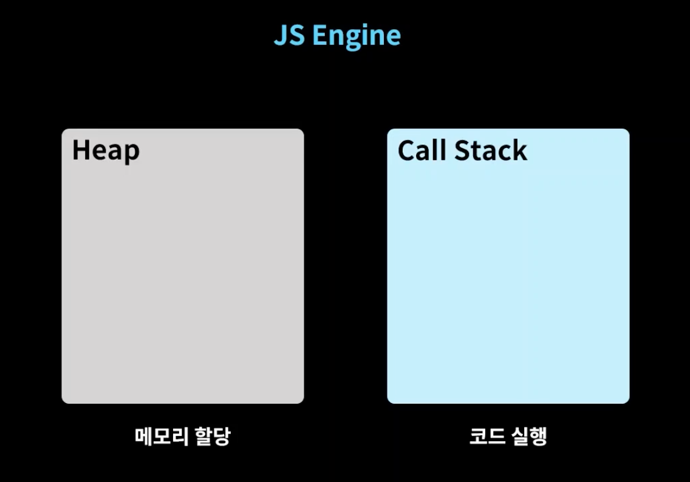
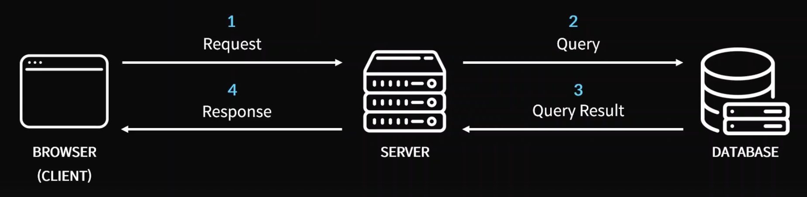

# WIL5

### 0부

리액트 네이티브를 통해 어플리케이션도 개발할 수 있음.

⇒ `node.js`는 백엔드에서 사용하는게 아닌가? 리액트를 사용함에 있어서 어떤 필요가 있는걸까. 우테코 과제를 하면서도 당황했던 부분 중에 하나니 이 의문을 해소하자. 

# 섹션 1. JavaScript 기본

구글 V8: 크롬 자바스크립트 엔진 (runtime)

변수명에 `_` 뿐만 아니라 `$`도 사용 가능함. 

`**var`와 `let`의 차이점**: 중복 선언 시에 문제가 발생함. (`var`는 같은 변수를 한 번 더 선언할 수 있음. ⇒ 코드가 많아질 시에 문제가 발생할수도.)

- **원시 타입(Primitive Type)**: 한 번에 하나의 값만 가짐. 하나의 고정된 저장 공간 이용.
- **비원시 타입(Non-Primitive Type)**: 한 번에 여러 개의 값을 가질 수 있음. 여러 개의 고정되지 않은 동적 공간 사용.

문자열: ```(백틱)으로 문자열에 변수를 넣을 수 있음. (**템플릿 리터럴**)

```jsx
let name = "GDSC";
console.log(`Hello ${name}`); // Hello GDSC
```

`null`: 아무 것도 없다는 것을 의도적으로 나타낼 때 사용.(아니면 `undefined`)

묵시적 형변환(캐스팅): 형변환이라는 것을 명시하지 않음.(의도하지 않은 형변환) ⇒ 명시적 형변환: `parseInt` 등

동적 타입 언어 ⇒ `typeof` 연산자를 통해 자료형을 파악함.

- **null 병합 연산자 `??`**: 피연산자 중에 null이나 undefined가 아닌 값을 선택함.

```jsx
let name = "GDSC";
console.log(typeof name); // string

let name;
name = "GDSC" ?? name;
console.log(name); // GDSC
```

### 함수 표현식

함수도 결국은 하나의 값이므로 변수나 상수에 담아 사용할 수 있음.

값으로 사용하는 함수는 이름을 선언하지 않아도 사용할 수 있음.

```jsx
let helloworld = function () {
	return "Hello World!";
} // **함수 표현식**

// 원래 우리가 사용하는 방식: **함수 선언식**
```

- **호이스팅**: 함수 선언 방식은 함수 선언을 아래쪽에 선언해도 위로 호출해서 사용 가능하게 함.(함수 표현식은 호이스팅이 불가능.)

```jsx
let helloworld = () => "Hello World!";
// **화살표 함수**. 호이스팅의 대상이 아님.
```

- **콜백 함수**: 함수를 함수의 매개변수로 넘겨줘서 이를 호출함. 유연한 동작을 할 수 있음.

### 객체

```jsx
let person = new Object(); // 객체 생성자 이용
let person = {}; // 객체 리터럴 방식
```

: 여러가지 데이터를 동시에 가질 수 있는 비원시 데이터타입.

`key`, `value` 쌍으로 이루어진 것을 객체의 **프로퍼티**라고 함.

```jsx
console.log(person.name); // 점으로 프로퍼티에 접근
console.log(person["name"]); // 대괄호로 접근
```

괄호 표기법을 통해 동적으로 객체의 프로퍼티에 접근할 수 있음.

const로 객체를 선언했다해도 프로퍼티는 수정 가능함. → 상수로 선언된건 프로퍼티가 아닌 오브젝트 그 자체.

### 배열

**배열**: 인덱스를 통해 배열의 요소에 접근함.

```jsx
console.log(arr.push(0));
console.log(arr.length);
```

- **반복문** - 객체의 키와 값을 순회하기 위해 배열로 추출해내는 방법.

```jsx
const personKeys = Object.keys(person); // 객체의 key값들을 순서대로 배열로 반환해줌.
const personValues = Object.values(person);
```

- 배열 내장 함수

```jsx
arr.forEach((elm) => (console.log(elm))); // 배열의 요소에 각각 콜백 함수를 실행함.
arr.map((elm) => return elm * 2); // 콜백 함수의 리턴값들을 모아 하나의 배열로 반환함.

// 배열에 특정 원소가 있는지를 확인하는 함수 (=== 연산)
arr.includes(number); // [true/false]

// 배열에 특정 원소가 어디에 존재하는지를 확인하는 함수
arr.indexOf(number); // -1일 경우, 원소가 존재하지 않음.

// 배열에서 조건을 만족시키는 원소를 만나면 인덱스를 반환하는 함수 (가장 먼저 만나는 원소)
arr.findIndex((elm) => elm.name === "GDSC"); // 비교 연산을 반환하는 콜백 함수를 이용함.

// 배열에서 조건을 만족시키는 원소를 만나면 그 원소 자체를 반환하는 함수
arr.find((elm) => elm.name === "GDSC");

// 배열에서 조건을 만족시키는 원소들을 모아 배열로 반환하는 함수
arr.filter((elm) => elm.name === "GDSC"); // 말그대로 필터의 역할.

// 배열을 원하는 만큼 잘라서 배열로 반환하는 함수
arr.slice(0,2); // [startIdx, endIdx)

arr.concat(another_arr) // 배열을 붙이는 함수

// 배열을 정렬하는 함수
arr.sort(); // 원본 배열을 정렬함. 문자를 기준으로 정렬함.
arr.sort(compare); // 비교 함수를 인자로 전달하여 원하는 방식대로 정렬함.

const compare = (a, b) => {
	if (a > b) return 1;  // 값이 1일 경우 두 값 사이의 대소 관계: 위치가 바뀌어야 함.
	else if (a < b) return -1; // 값이 -1일 경우: 위치 관계가 바뀌지 않아도 됨.
	else return 0;
}

// 요소들을 하나로 잇는 함수
arr.join(); // 쉼표로 구분하여 요소들을 이어서 반환함.
arr.join(" "); // 원하는 인자를 넣으면 그 인자로 요소를 이음.
```

⇒ 정확한 `compare` 함수의 동작 원리를 알아놓을 필요가 있을듯. 내가 적은대로 이해하는 게 맞는건지 확인이 필요함.

# 섹션 2: JavaScript 응용

- `**true**`: `[]`, `“0”`, `Infinity`
- `**false**`: `null`, `undefined`, `-0`, `NaN`, `“ “`

⇒ 예외를 처리를 할 때 유용하게 사용 가능함.

- **삼항 연산자**

```jsx
{조건문} ? {참일 때 수행할 식} : {거짓일 때 수행할 식};
```

삼항 연산자는 연달아서 중첩해서도 사용할 수 있음. 가독성은 떨어짐.

- 단락 회로 평가

OR나 AND 연산에서 첫 번째 값만으로도 결과를 알 수 있을 경우에 더이상 연산하지 않고 반환함. → 이외의 경우에는 뒷 값을 반환함.

`OR`: 앞 값이 참일 경우 결과가 무조건 참이므로 앞 값을 반환함.

`AND`: 앞 값이 거짓일 경우 결과가 무조건 거짓이므로 앞 값을 반환함.

- 비구조화 할당 (파이썬의 `unpacking`과 비슷한 듯.)

```jsx
let arr = [1, 2, 3];
let [one, two, three] = arr; // 기본 변수 비구조화 할당

let [one, two, three] = [1, 2, 3]; // 위 코드를 더 짧게 작성한 것. **선언 분리**.

let [one, two, three, four = 4] = [1, 2, 3]; // 할당되지 못할 때 기본값을 설정할 수 있음.
```

기본적인 `swap`도 비구조화 할당을 통해 할 수 있음.

```jsx
[a, b] = [b, a]
```

객체의 비구조화 할당

```jsx
let obj = { one: 1, two: 2, three: 3, name: "GDSC" }
let { name: myName, one, two, three } = object;

// myName이라는 변수에 name 프로퍼티 값을 따로 배정해줌.
```

- `**spread` 연산자** - 클래스 상속, `unpacking`과 비슷한 개념.

기존 객체에 있던 내용을 다른 객체에도 그대로 펼칠 수 있음.

배열도 똑같이 펼쳐서 접근할 수 있음.

### 동기/비동기 처리

스레드: 코드를 한 줄 한 줄 처리하는 역할. (동시에 처리하지 않음.)

→ 멀티 스레드를 이용하면 쉽게 해결 가능함. 하지만 자바스크립트는 싱글 스레드.

하나의 작업이 수행될 때 다른 작업도 수행 가능하도록 **비동기 처리, 논블로킹 방식**을 이용함.

```jsx
setTimeout(/*콜백 함수*/ () => {}, /*딜레이*/ 1000);
```

비동기 함수에서는 콜백 함수를 인자로 전달하여 함수 내 지역 변수를 활용할 수 있음.

호출 순서에 상관없이 기다리는 만큼 나중에 실행됨.



자바스크립트는 call stack이 하나만 있는 싱글 스레드 언어.

콜백함수를 중복해서 비동기 처리의 결과를 다음 비동기 함수의 인자로 사용하는 경우 → 너무 중첩이 많이 되면 **콜백 지옥**이라 표현함.

### `Promise`

콜백 지옥에서 탈출하는 방법.

- **비동기 작업이 가질 수 있는 상태**
: 대기 상태(Pending), 성공(Fulfilled) - `resolve`, 실패(Rejcted) - `reject`

```jsx
function isPositive(number) {
	const executor = (resolve, rejected) => {
		// 실행자
		setTimeout(() => {
			if (typeof number === "number") { // resolve
				resolve(number >= 0 ? "Positive" : "Negative");
			} else { // reject
				reject("Not a Number");
			}
		}, 2000);
	};
	const asyncTask = new Promise(executor); // 전달하는 순간 executor가 실행됨.
	return asyncTask;
}
```

`Promise`를 반환한다는 것은 이 함수가 비동기처리를 하며 비동기 처리의 결과를 `then`과 `catch`를 통해 이용할 수 있음을 나타냄.

```jsx
const res = isPositive(100);

res
	.then((res) => {
		console.log("작업 성공: ", res);
	})
	.catch((err) => {
		console.log("작업 실패: ", err);
	});
```

비동기 처리의 결과를 이용하기 위해 사용함.

⇒ 계속해서 `Promise` 객체를 반환하고, 이를 인자로 받는걸 반복하여 콜백 지옥을 없앰.

⇒ `then chaining`

중간중간에 값을 저장했다가 다시 이용하는 등으로 이용이 가능함. 가독성 있고 깔끔한 비동기 처리를 도와줌.

### `async & await`

비동기를 더 편리하게 이용하게 해줌.

```jsx
async function hello() {
	return "Hello";
} // Promise 객체를 반환함. then도 사용 가능함.
```

`await`를 비동기 함수 앞에서 사용하면 그 줄에서만 동기적으로 작동함.

`async` 함수 안에서만 사용 가능.

### API 호출 & `fetch`

